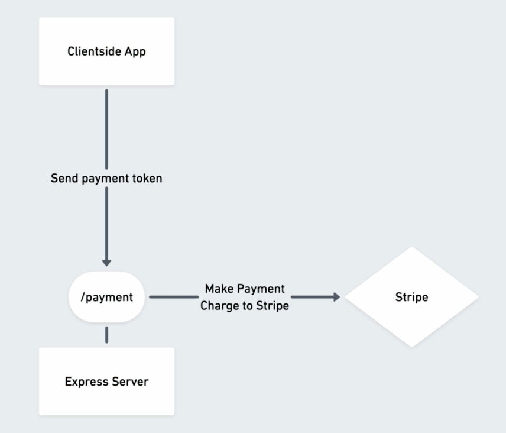

# React Store Server (Node.js) + Express
#### for the Client: React Store App (react: 16.13.1) + Hooks

E-commerce project DEMO:
- [Client](https://react-store-09.vercel.app)
- [Server](https://react-store-express-server.herokuapp.com)

---------------

``` 
    npm run start
```

Go to [localhost:5000](http://localhost:5000)

---------------

## Stripe

[Dashboard](https://dashboard.stripe.com/test/dashboard)

Get your test API keys:
- Publishable key
```pk_test_51HUdpkACECHr7zdXSvwikJSLZvvzenT76gVosm1ut8CR8r5n2c6VZA8V58p4MoWcMpxtztuOeo2poQ9xWESfUvuH00ETkLW0Xj```
- Secret key (!make Repo Private!)
```sk_test_51HUdpkACECHr7zdXaw881X55N3DwWbcG11ceVass1L0haLX2gRRhVyMW5qTPRPorwvzIl6MLOPdbpsuIubj1lpLn00TZQeT9dp```





-------------

### [Heroku Dashboard](https://dashboard.heroku.com/apps/react-store-express-server/logs)

``` 
    2020-11-07T21:32:17.746438+00:00 heroku[web.1]: Starting process with command `npm start`
    2020-11-07T21:32:20.068046+00:00 app[web.1]: 
    2020-11-07T21:32:20.068065+00:00 app[web.1]: > react-store-server@0.2.0 start
    2020-11-07T21:32:20.068065+00:00 app[web.1]: > node ./bin/stripe
    2020-11-07T21:32:20.068065+00:00 app[web.1]: 
    2020-11-07T21:32:20.244334+00:00 app[web.1]: Server running on port 5987
```
